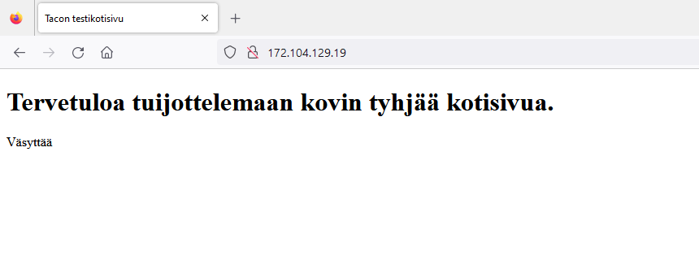

# h4 Tehtävät

Tässä tehtävässä kuvaan komentokehotetehtävien tekemistä. Kirjoitin myös "Command Line Basics Revisited":ä hieman tiivistelmää.

## Tiivistelmä artikkelista "First Steps on a New Virtual Private Server – an Example on DigitalOcean and Ubuntu 16.04 LTS"

- Tärkeintä on hyvä salasana, hyvä salasana ja hyvä salasana. Murtautumisesta tulee muuten aivan liian helppoa ulkopuolisille.
- Oman virtuaalisen palvelimen voi vuokrata esim. [Linodelta](https://www.linode.com/).
- Palvelimelle voi kirjautua käyttämällä Secure Shell -komentoa eli SSH:ta.
  
        $ ssh root@serverin.ip.osoite
  
- Palvelimen palomuurista tulee avata portti (muuten kukaan ei pääse sisään) ja ei kannata myöskään unohtaa palomuurin aktivointia.
- Ennen Root-kirjautumisen sulkemista tulee luoda admin-käyttäjä.
- Hyvän salasanan lisäksi ei saa unohtaa päivittää softaa, paitsi jos haluaa tunkeutujia (jostain syystä).
- Palvelimeen pääsee käsiksi ip-osoitteen kirjoittamalla selaimen osoitekenttään, mutta tämän jälkeen askeleena voisi olla oman DNS-nimen vuokraaminen.

## Harjoitukset

### a) Virtuaalipalvelimen vuokraaminen

17.9.2023, 23.24:
Harjoitus alkoi [Linoden](https://www.linode.com/) nettisivuilta. Käyttäjän luomisen olin tehnyt jo luennon aikan ja edessä oli virtuaalisen palvelimen vuokraaminen. Kuvasta näkyy lähes kaikki olennaiset tiedot: 
- Linuxin versio (Debian 12),
- mistä päin virtuaalipalvelinta hostataan (Saksa on ihan tarpeeksi lähellä) ja
- kuinka tehokas palvelin tuli olemaan (1GB on vallan mainio, sekä hinnaltaan että nopeudeltaan, tämän kurssin tarpeisiin).

    

### b) Virtuaalipalvelimen alkutoimet

17.9.2023, 23.56:
Palvelimen alkutoimet alkoivat sillä, että kirjauduin sisään root-käyttäjänä (käytännössä adminstrator). Heti tässä vaiheessa juoksin jo seinää päin ja yrittäessäni säätää palomuuria, komentorivi antoi minulle tämän vastauksen:

    sudo: ufw: command not found

Kulutin siis seuraavat puoli tuntia raivokkaasti googlettelemalla. Lopulta päädyin siihen tulokseen, että ufw ei ole asennettuna. Mutta yrittäessäni asentaa sitä, kertoi komentorivi puolestaan näin:

    E: Package 'ufw' has no installation candidate

Lopulta tajusin että olin hätäillyt koko prosessin (klassinen virhe) ja unohtanut päivittää paketit "sudo apt update" komennolla. Tämä tietenkin korjasi tilanteen ja pääsin aloittamaan. Ensimmäisenä avasin SSH:ta varten 
reiän ja tämän jälkeen käynnistin palomuurin.

Tämän jälkeen loin uuden Sudo-käyttäjän ja annoin kyseiselle käyttäjälle oikeat oikeudet.

Lukitsin rootin ja olettaisin että tämä onnistui, koska en päässyt enää kirjautumaan root:na sisään. Siksi ryhdyin tekemään loppuja säätöjä aikaisemmin luomallani admin-käyttäjällä.

Tein sudo käyttäjänä seuraavat komennot (jotka myös kuvakaappauksista näkyvät):

    sudo apt-get update
    sudo apt-get dist-upgrade
    sudo systemctl reboot

Lopulta myös palasin takaisin sudo-käyttäjän huomaan.

### c) Weppipalvelin omalle virtuaalipalvelimelle

18.9.2023, 12.20:
Tämän tehtävän aloitin avaamalla portit, jotta voisin tuijotella Apachen aloitussivua. Kuten viime viikolla, aloitussivu neuvoi vaihtamaan aloitussivua.

    /var/www/html/index.html

Siirryin siis komentokehotteeseen vaihtamaan apachen sivun html:ää omanlaisekseni. Avasin apachen sivuija määrittävän html-tiedoston ja tein siitä erilaisen (ja vähemmän visuaalisesti miellyttävän).

Testasin myös mobiililaitteella nettisivun toimivuutta ja se avautui normaaliksi. Seuraava askel olisi ollut hankkia julkinen DNS nimi, mutta päätin siirtää kyseisen askeleen myöhemmäksi.

### d) Murtautumisyrityksiä

18.9.2023, 13.05:
Etsin murtautumisyrityksiä seuraavalla komennolla:

        $ sudo journalctl -n 2000

Vastaukseksi eteeni pamahti kasa lokimerkintöjä ja (oletettavasti) murtautumisyrityksiä. Vaikkei murtautumiset tulleet yllätyksinä, ehkä niiden määrä oli minusta kovin hämmentävää. Oma palvelimeni kun oli ollut päällä vasta alle vuorokauden.

Nopeasti analysoituna lokitiedoista sai selville seuraavanlaisia asioita:
- Ajankohta
- Mitä kautta palvelimelle yritettiin päästä (tai murtautua) tai onko palomuuri kokonaan estänyt yhteyden
- Käyttäjän nimi
- Käyttäjän ip-osoite
- Mitä porttia yritettiin käyttää.

Tämän enempää en lähtenyt asiaa tutkailemaan, vaan päätin sen siirtää toiseen kertaan.

## Lähdeviitteet

Karvinen, Tero, Saatavilla 17.9.2023: https://terokarvinen.com/2017/first-steps-on-a-new-virtual-private-server-an-example-on-digitalocean/

