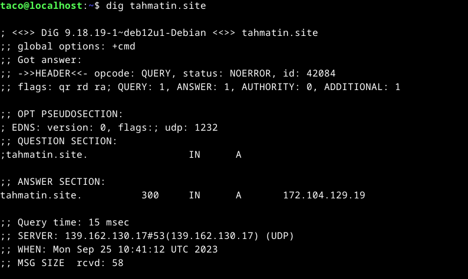
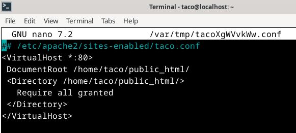

# h5 Tehtävät

Tässä tehtävässä kuvaan komentokehotetehtävien tekemistä. Kirjoitin myös "Command Line Basics Revisited":ä hieman tiivistelmää.

## Tiivistelmät tehtävän artikkeleista

### New Default Website with Apache2 – Show your homepage at top of example.com, no tilde

- Uusi VirtualHost tulee luoda. Tämä onnistuu luomalla uusi .conf-tiedosto "sites-available" hakemistoon komennolla  `sudoedit /etc/apache2/sites-enabled/home.conf`.

- Default VirtualHost pitää laittaa pois päältä ja uusi laittaa puolestaan päälle. Onnistuu komennoilla `sudo a2ensite home.conf` ja `sudo a2dissite 000-default.conf`.

- Hakemistoon /home/käyttäjänimi/public_html/ luodaan kotisivut tiedostoon index.html.

### Name Based Virtual Hosts on Apache – Multiple Websites to Single IP Address

- Yhden nimipohjaisen VirtualHostin alla voi olla useita ip-osoitteita.
  
- Weppisivuja voi luoda normaalit käyttäjät (ilman sudo -oikeuksia).

### Name-based Virtual Host Support

- Nimiperusteisia suositellaan verrattuna numeropohjaisiin hosteihin.

- VirtualHostilla pitää olla aina oikeat tiedot, jolloinka käyttäjä ohjautuu oikeaan suuntaan. Pyynnöt ohjataan niiden asetuksia mahdollisimman paljon vastaaviin VirtualHosteihin.

## Harjoitukset

### a) Domain-nimen vuokraaminen ja osoitus oikeaan virtuaalipalvelimeen

25.9.2023, 9.24:
Domain-nimen vuokraaminen alkoi sillä, että yritin selvittää miten gihub educationin kautta olisi saanut domainin ".me" -tunnuksella käyttöön. Löysin vaihtoehdon, joka vei minut NameCheapin sivulle, joka on linkitetty kyseiseen 
vaihtoehtoon. Kuitenkin sivulla oli erikseen maininta, joka kertoi siitä miten kyseinen diili on käytössä vain tiettyjen yliopistojen kanssa.
    

En jäänyt toisia vaihtoehtoja selvittämään, vaan päätin ratkaista ongelmat rahalla, eli vuokrasin suoraan [NameCheapista](https://www.namecheap.com/) omaa rahaa käyttämällä itselleni nimen. Varmistin että auto-renew -vaihtoehto oli pois päältä, ja iskin 
luottokortin pöytään. Mielenkiintoisena sivumietteenä huomasin ettei NameCheap hyväksynyt edes profiilia luodessa (tai luottokortin tietoja antaessa) ääkkösiä. Ostin nimen noin 1 euron hintaan, ja kuin sormia napsauttamalla, 
nimi [tahmatin.site](http://www.tahmatin.site) oli hyppysissäni. Ensimmäisenä tekona laitoin domainin nimen osoittamaan edellisessä tehtävässäni luotuun weppisivun IP-osoitteeseen ja päätin tässä kohtaa pitää hetken tauon. Tauolta palattuani katsoin oliko 
yhdistys onnistunut ja pääsin kuin pääsinkin tuijottamaan kotisivuani.

### b) "host"- ja "dig"- komentojen tutkiminen

25.9.2023, 10.36:
Tehtävä alkoi monen edellisen tehtävän tapaan komennoilla `sudo apt-get update` & `sudo apt-get upgrade`. Tämän jälkeen kokeilin komentoa `host tahmatin.site` mutta tämä ei onnistunut. Pienen googlauksen jälkeen sain selville että komento vaatii 
"dnsutils" -paketin, jolloinka sen siis asensin. 

Asentamisen jälkeen ajoin komennon `host tahmatin.site` ja sain näkyviini oman sivuni ip_osoitteen ja viisi tällaista ilmoitusta: `tahmatin.site mail is handled by * eforward1.registrar-servers.com.` Nopealla googlauksella en saanut kattavaa vastausta,
mutta sain esimerkiksi sen selville, että tähden kohdalla on numero määrittelee pyynnön prioriteetin (pienempi parempi). Päätin yrittää dig-komentoa seuraavaksi.

Nopealla googlauksella (ensimmäisiä vaihtoehtoja, ei ollut vaikea löytää hakusanoilla "dns dig command")  löysin [tällaisen](https://phoenixnap.com/kb/linux-dig-command-examples)) artikkelin, joka auttoi minua kattavasti selvittämään mitä 
seuraavan kuvan teksti tarkoittaa. 

- Ensimmäinen rivi kertoo Dig-komennon version ja sivun johon otettiin yhteyttä
- HEADER -rivi näyttää informaatiota ja missä formaatissa mitä sivulta saatiin
- OPT PSEUDOSECTION -kohta näyttää ilmeisesti jos DNS:ssä on käytetty laajennuksia, jotain lipuista (jos niitä olisi käyttäny) ja mikä oli UDP-paketin koko.
- QUESTION -kohta kertoo mihin komento lähetti kyselyn, mikä oli kyselyn luokka ja minkä tyyppinen kysely oli
- ANSWER -kohta puolestaan vastaa edellisiin kyselyihin, tämän huomaa identtisistä kohdista. Näiden lisäksi tässä kohdassa oli myös kohteen TTL (Time-to-Live) ja kohteen ip-osoite. 

### c) Oman kotisivun uusiminen

Aloitin kotisivun uusimisen päivittämällä taas paketit. Tämän jälkeen seurasin aikaisemmin tiivistämääni [artikkelia](https://terokarvinen.com/2016/02/16/new-default-website-with-apache2-show-your-homepage-at-top-of-example-com-no-tilde/) ja sen ohjeita.

Aloitus sujui hyvin, ja sain asetettua hyvin uuden virtualhostin ohjeita seuraamalla. Tämän jälkeen alkoi tehtävä mennä alamäkeen ja kulutin troubleshoottaamiseen yhteensä n. tunnin myöhästyen myös tehtävänpalautuksesta, mutta itsepäisenä en halunnut
luovuttaa ja palauttaa keskeneräistä tehtävää. Käytin komentoja `sudo a2ensite tero.conf` ja `sudo a2dissite 000-default.conf` sulkeakseni defaultin ja avatakseni oman virtualhostin. 

Tämän jälkeen weppisivuni alkoi heittämään virhekoodia 403, ja tutkiessani logeja sain selville että ilmeisesti minulta puuttuu tiedostoja (tai ne ovat vähintäänkin väärässä paikassa).

    [core:error] [pid 37902:tid 140445967414976] (13)Permission denied: [client 80.220.91.106:56984] AH00035: 
    access to / denied (filesystem path '/home/taco/public_html') because search permissions are missing on a component of the path

Yritin luoda uuden index.html -tiedoston ohjeissa näytetyllä tavalla, mutta tämä ei ratkaissut virhekoodia. Pitkän googlettelun jälkeen, päätin viimeisenä yrityksenä laittaa koko virhekoodin googleen ja sainkin vastauksen 
[askubuntu](https://askubuntu.com/questions/451922/apache-access-denied-because-search-permissions-are-missing) -verkkosivulta. Tässä vaiheessa päätin testata mitä tahansa keinoa, joten lähdinkin kokeilemaan sivulla kuvailtua kenoa, joka ilmeisesti
vaihtaa jollain tavalla oikeuksia. 

Ja kappas keppanaa, uusi index.html näkyykin sivulla!

## Lähdeviitteet

Karvinen, Tero, Saatavilla 25.9.2023: https://terokarvinen.com/2018/name-based-virtual-hosts-on-apache-multiple-websites-to-single-ip-address/
Karvinen, Tero, Saatavilla 25.9.2023: https://terokarvinen.com/2016/02/16/new-default-website-with-apache2-show-your-homepage-at-top-of-example-com-no-tilde/
Apache Software Foundation, Saatavilla 25.9.2023: https://httpd.apache.org/docs/2.4/vhosts/name-based.html
AskUbuntu, Saatavilla 25.9.2023: https://askubuntu.com/questions/451922/apache-access-denied-because-search-permissions-are-missing
PhoenixNAP, Saatavilla 25.9.2023: https://phoenixnap.com/kb/linux-dig-command-examples
