# h6 Tehtävät

## Tiivistelmät tehtävän artikkeleista

###  Python Web - Idea to Production - 2023

- Python palvelee asiakkaita kaikilla alustoilla ja selaimilla
- Osaa kerätä tietoa itsestään, siitä miten palvelua käytetään
- Käyttäjät voivat olla asentamatta mitään, toimii silti
- Käyttää aina uusinta versiotaan.

###  Django 4 Instant Customer Database Tutorial

- Tutoriaali Django 4 käyttäjätietokehykseen ja sen luomiseen

- Kehitysympäristössä mm.
  - Asennetaan  kehittämisen ympäristö
  - Luodaan Djangolla projekti
  - Tehdään asiakastietokanta

###  Deploy Django 4 - Production Install

- Tutoriaali siitä miten Django 4 käytetään tuotannossa
- Microa ja Apache2:ta käytetään
- Tärkeää yhdistää Python ja Apache2, muuten apache ei osaa käyttää Python-ohjelmia
- Tutoriaali näyttää miten saada static assetteja sivulle.
  

## Harjoitukset

### a) Asenna Django-kehitysympäristö (esimerkkisivu)

2.10.2023, 10.36:
Tehtävä alkoi tuttuun tapaan komennoilla `sudo apt-get-update` ja `sudo apt-get upgrade`. Tämän jälkeen lähdin asentelemaan sudolla virtualenv:iä.

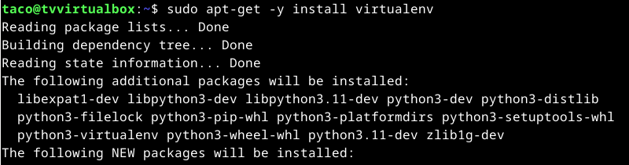

Tämän jälkeen käytin komentoa `--system-site-packages -p python3 env/` ja loin uuden virtuaaliympäristön.

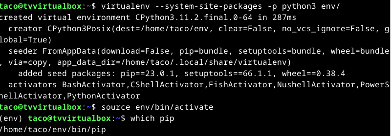

Komennolla `source env/bin/activate` otin käyttöön uuden virtuaaliympäristön. Tämän jälkeen loin uuden tiedoston "requirements.txt", jonka tekstiksi muutin "django". Tällä (aikaisemmin epäturvalliseksi kerrotulla tavalla) asensin siis Djangon!
Käynnistin tämän projektin komennolla `django-admin startproject tahkoco`. Palvelin käynnistyi komennolla `./manage.py runserver` ja viimeisessä kuvassa näkyy oikea kotisivu!

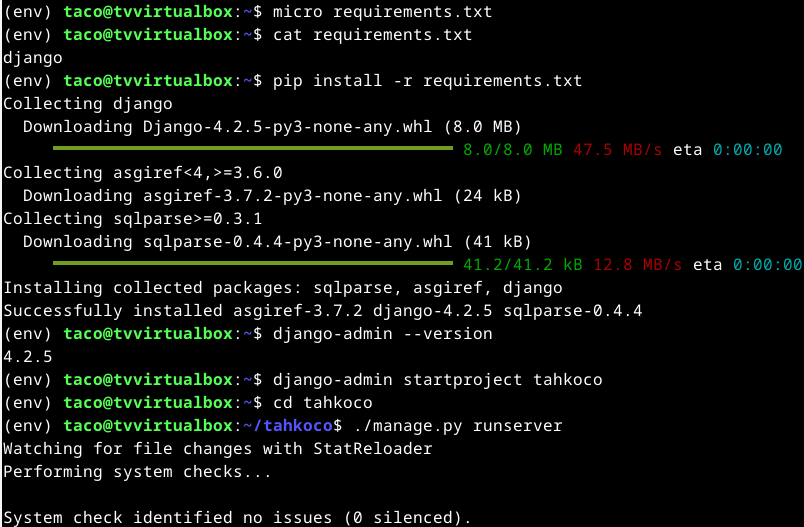

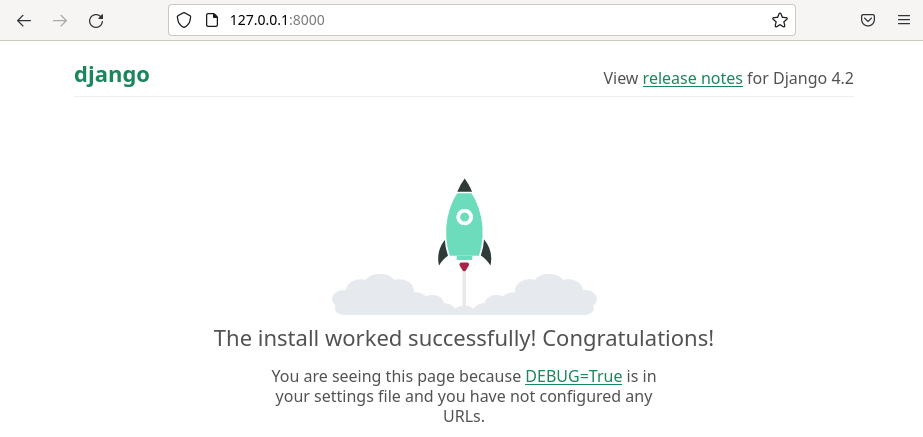

### b) Yksinkertainen esimerkkitietokanta

25.9.2023, 10.36:
Jatkoin suoraan edellisestä kohdasta tätä tehtävää. Aloitin projektin päivittämällä tietokannat.

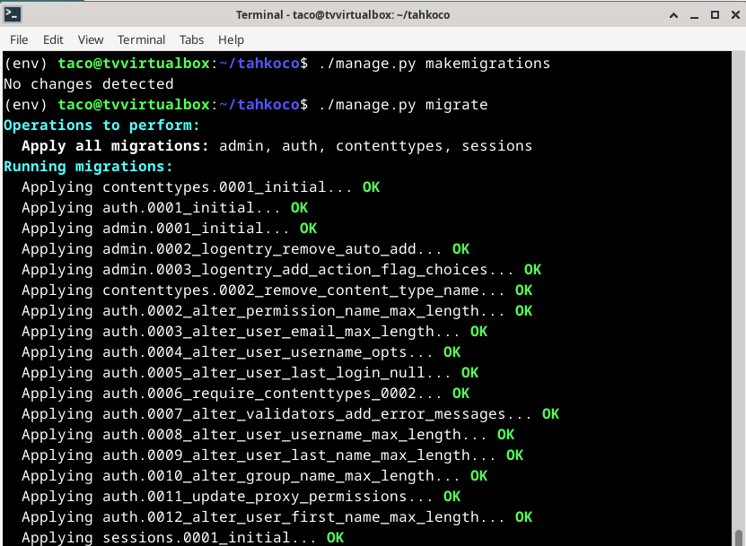

Samalla loin myös admintunnukset.

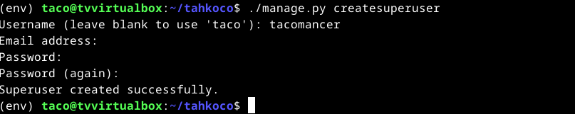

Djangon admin-sivulla loin uuden käyttäjän, jolle annoin oikeat oikeudet.

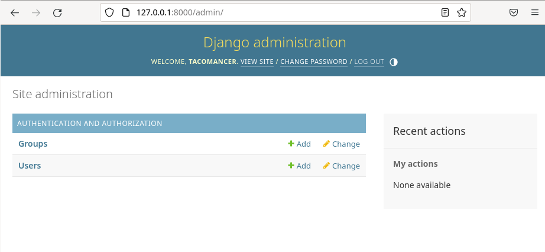

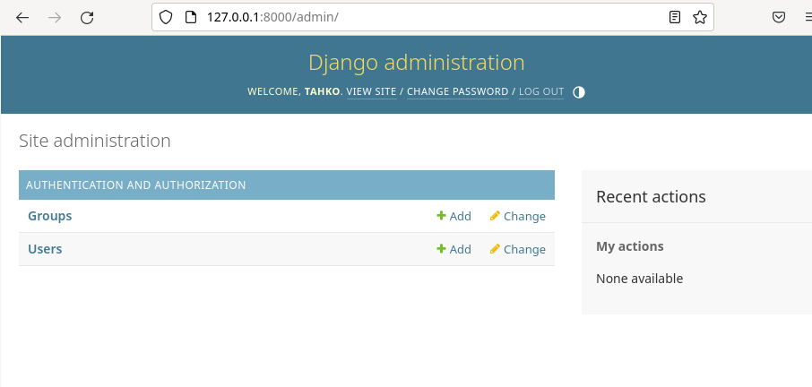

Aloin luomaan käyttäjien tietokantaa ohjeiden mukaan. Ensin aloitin komennolla `./manage.py startapp crm` ja tämän jälkeen avasin asetukset komennolla `micro teroco/settings.py`. Kyseiseen paikkaan lisäsin oikean kansion "crm".

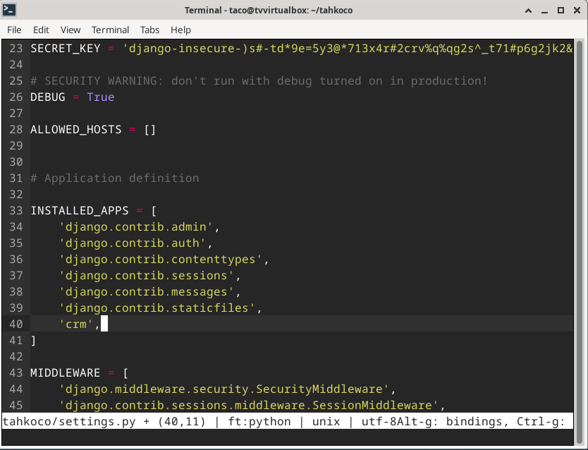

Jatkoin tietokannan luomista ensin asettamalla asiakkaille tietokannan tablen, ja asetin sen adminiin.

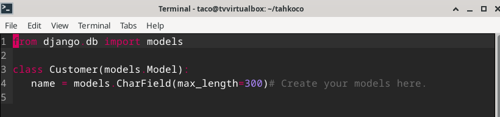
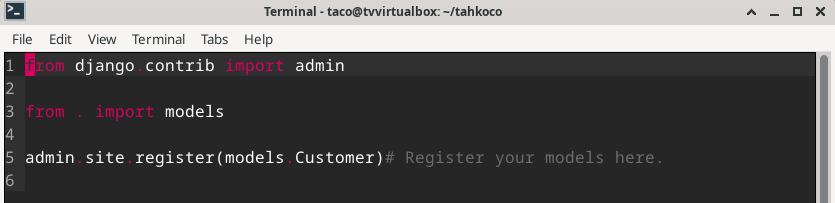

Loipulta minun piti vielä saada käyttäjätiedot näkymään niille asetetuilla nimillä. Tämän tekeminen oli helppoa, aloitin muokkaamisen komennolla `micro crm/models.py`. Tämä avasi saman tiedoston joka määritteli 
aikaisemminkin meille asiakkaita, ja siihen piti tehdä vain hienoinen muutos. 

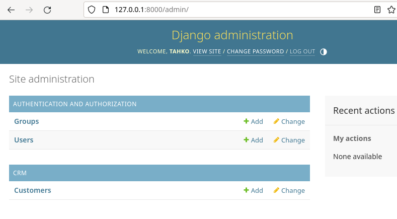
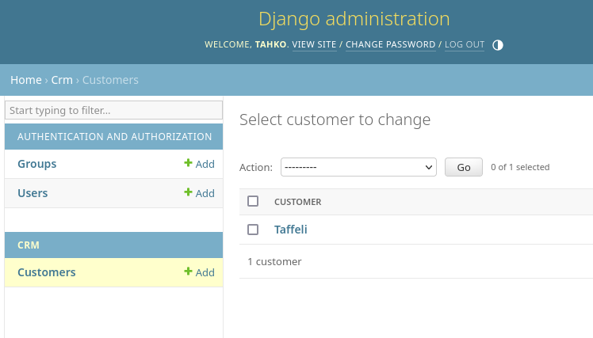

### c) Djangon tuotantotyyppinen asennus

Aloitin tämän tehtävän tekemisen myöhään, mikä oli virhe, silä se johti omaan huolimattomuuteen ja turhautumiseen. Tämä lopulta sai minut luovuttamaan virheen edessä (joka luultavimmin olisi helposti löydettävissä, jos kello ei olisi ollut liian paljon).
Tehtävä alkoi klassisella kaiken päivittämisellä sudo:ssa. Minulla oli jo micro ja apache asennettuna, jolloinka niiden asentamiseen ei aikaa mennyt. Muokkasin ensimmäiseksi siis localhost:in html:ää paremman näkoiseksi.

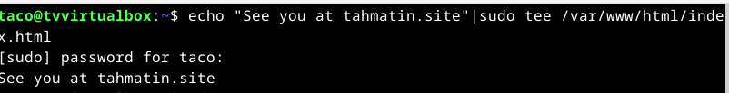

Seuraavaksi loin testiviestin, ja pääsin tutkimaan VirtualHostia. Laitoin oman kotisivuni päälle ja suljin muut. Testasin apachea ja sain testiviestini takaisin.

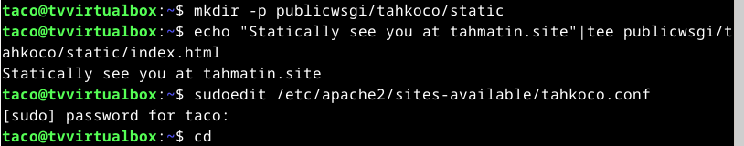
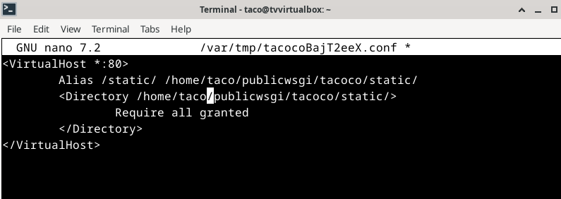
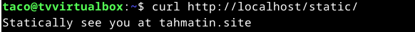

Seuraavaksi lähdin asentamaan Djangoa ja tätä en saanut valmiiksi errorin takia. Aloitin asentamisen lataamalla komennolla `sudo apt-get -y install virtualenv` virtuaaliympäristön. 
Tämän jälkeen laitoin ympäristön käyttöön komennolla `source env/bin/activate`. Tämän jälkeen asensin Djangon.

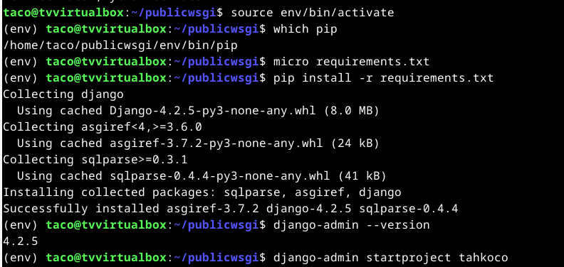

Käytin jo aikaisemmin luomaani "tahkoco"-projektia. Voi olla että tämä aiheutti ongelmani, sillä en ehkä aikaisemmin kiinnittänyt asetuksiin tarpeeksi hyvin huomiota. Joka tapauksessa aloitin 
muokkaamalla komennolla `sudoedit /etc/apache2/sites-available/tahkoco.conf` jotta saisin pythonin yhdistettyä apacheen.

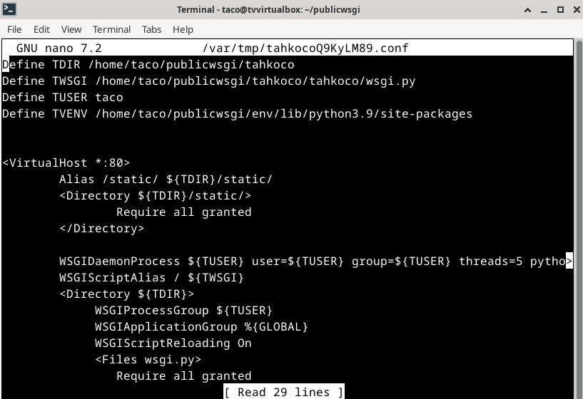

Tämän jälkeen asiat näyttivät hyvältä, kunnes huomasin seuraavanlaisen virheen:

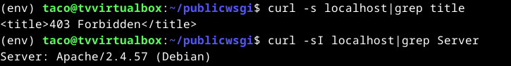

403? Taasko olen laittanut jonkun tiedoston (vai sanan/kirjaimen tiedostossa?) väärään paikkaan? Varmensin vielä virheen localhostissa:

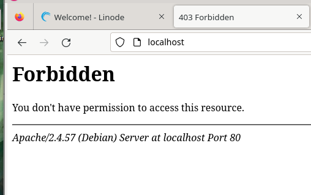

Yritin troubleshoottaa tätä ongelmaa huonolla menestyksellä. Päätin tähän kohtaan lopettaa kellon oltua jo paljon ja kysyä luennolla apua ongelmaani.

## Lähdeviitteet

Karvinen, Tero, Saatavilla 2.10.2023: https://terokarvinen.com/2023/python-web-idea-to-production/#osaamistavoitteet

Karvinen, Tero, Saatavilla 2.10.2023: https://terokarvinen.com/2022/django-instant-crm-tutorial/

Karvinen, Tero, Saatavilla 2.10.2023: https://terokarvinen.com/2022/deploy-django/

AskUbuntu, Saatavilla 25.9.2023: https://askubuntu.com/questions/451922/apache-access-denied-because-search-permissions-are-missing

PhoenixNAP, Saatavilla 25.9.2023: https://phoenixnap.com/kb/linux-dig-command-examples
