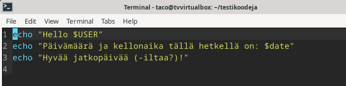
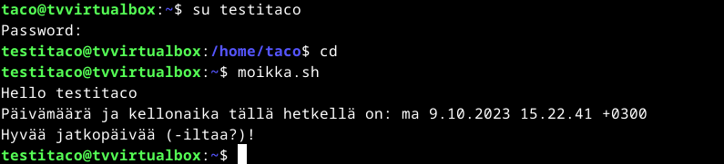

# h7 Tehtävät

## Kaikki läksyraportit

h1 - https://github.com/Orjakauppias/linuxpalvelimet_TV/blob/e689ff4f61488e91f9376376c597ea74cfa0baa1/h1.md

h2 - https://github.com/Orjakauppias/linuxpalvelimet_TV/blob/85a537afbcca58dfa6e816210133a4c54ece48ef/h2.md

h3 - https://github.com/Orjakauppias/linuxpalvelimet_TV/blob/b2171fe85d0443eaa70e95f8d2a50a24127b92a5/h3.md

h4 - https://github.com/Orjakauppias/linuxpalvelimet_TV/blob/b018026e823a3feabf1d44d60438dd8d4b8a3d12/h4.md

h5 - https://github.com/Orjakauppias/linuxpalvelimet_TV/blob/1b7998c30f75fada6db82c5864e12096b5f7eb38/h5.md

h6 - https://github.com/Orjakauppias/linuxpalvelimet_TV/blob/e7941f11dd2984b0b14d278c2e421b0ce308f6b3/h6.md

h7 - tässä näin

## Tiivistelmä tehtävän artikkelista

###  Python Web - Idea to Production - 2023

#### Hello World Python3, Bash, C, C++, Go, Lua, Ruby, Java – Programming Languages on Ubuntu 18.04

- "hello world" on jokaisen ohjelman aloituksen ydin, josta prosessi alkaa. Se testaa että ymppäristö toimii.

- Artikkelissa kerrotaan seuraaville koodikielille miten "hello world" kirjoitetaan (linux-ympäristössä):
  - Python 3
  - Bash
  - C
  - C++
  - Java
  - Go
  - Ruby
  - Lua 

## Harjoitukset

### a&b) "Hei maailma" (Python, Java ja C, bonuksena Bash)

9.10.2023, 9.46:
Tehtävä alkoi tuttuun tapaan komennoilla `sudo apt-get update` ja `sudo apt-get upgrade`. Tämän jälkeen lähdin
testaamaan mitä minulla oli jo asennettuna (python ja C) komennolla `$ <koodikieli> --version`. Java ei
ollut vielä asennettu, mutta asensin tunnilla käydyn version komennolla `sudo apt-get install openjdk-17-jdk`.
Loin myös testikoodeja-kansion, jotta kaikki koodinpätkät säilyisivät hyvin yhdessä paikassa.

Ensimmäisenä testasin Pythonia. Loin uuden tiedoston päätteellä ".py" ja kirjoitin sinne lukutehtävän artikkelin 
tavoin. Tarkistin tiedoston ja ajoin sen kuvakaappauksen mukaisilla komennoilla.

Seuraavaksi tein helloworld-tiedoston, tällä kertaa päätteellä ".java". Tein samoin kuin edellisessä kohdassa. 
Huomasi kuvakaappauksen jälkeen että minun olisi kannattanut kääntää tiedosto `javac`-komennolla, mutta tein sen heti
kuvakaappauksen jälkeen.

Javan jälkeen aloin C-kielellä tekemään samaa. Seurasin lukuartikkelin ohjeita, ja ainoa asia missä jouduin hetken
käyttämään pohdintaa oli keksiä mihin kohtaan "\n" laittaisin tiedostossa.

Päätin yhdistää b)-kohdan myös tähän ja testasin bashia (sitä kun tuli käytettyä seuraavissa tehtävissä joka
tapauksessa. Bash oli varmasti helpoin näistä testeistä, mutta se taitaa bashin luonteeseen myös kuulua. Tiedoston
loin microlla taas lukuartikkelin ohjeita noudattaen.

### c) Interaktiivinen taskulaskin

9.10.2023, 10.15:
Tein tämän tehtävän käyttäen ohjeissa mainittua Jupyteria (ipython3). Kyseisen ohjelman asennettuani (tuttu
sudo apt-get install nönnönnöö) käynnistin ohjelman ja ohjelma rullasi heti. Kuvakaappauksesta 
näkee että testasin muutamaa toimintoa, mutta en syventynyt enempää tällä kertaa kyseiseen laskimeen.

Tässä kohtaa minulle tuli kiireellinen meno, niin jouduin jatkamaan tehtävää palattuani menoilta.

### d) Shell-script

9.10.2023, 14.36:
Tehtävässä päätin ottaa melko yksinkertaisen reitin ja luoda scriptin joka ensin tervehtisi käyttäjää, kertoisi 
päivämäärän ja ajan ja lopuksi toivottaisi hyvää jatkoa. Scriptin luominen ei tuonut suuremmin ongelmia ja tällä 
kertaa pidin tarkasti huolta siitä, että olen koko ajan tietoinen siitä, missä tiedostot seikkailevat.

### e) Uusi komento

9.10.2023, 15.01:
Pääti käyttää edellistä tiedostoa tässä tehtävän kohdassa. Kopioin tiedoston oikeaan kansioon ohjeissa mainitulla 
komennolla `chmod ugo+rx shellskripti.sh; sudo cp shellskripti.sh /usr/local/bin/`. Ohjeissa myös sanottiin että tiedostoon
tulisi lisätä `#!/usr/bin/bash` tulkiksi eteen.

Päätin vielä luoda uuden käyttäjän ja testata komentoani "moikka.sh" tällä uudella "testitacolla". Ja kappas keppanaa, sehän 
toimi hyvin!

### f) Intelligent intelligence

Aikani loppui kesken ja muuta aikataululliset haasteet tulivat vastaan. Päätin yrittää tehdä tätä kohtaa 
illemmalla treeninä laboratorioharjoitukseen. 

### g) Laboratorioharjoituskone

Päätin koneenkin luoda vasta illalla, mutta lyhykäisyydessään koneen luomiseen käytetään omia ensimmäisistä 
kotitehtävistä tuttuja h1-raportin askelia. Aktivoin myös palomuurin ja päivitän samalla paketit.

## Lähdeviitteet

Karvinen, Tero, Saatavilla 9.10.2023: https://terokarvinen.com/2018/hello-python3-bash-c-c-go-lua-ruby-java-programming-languages-on-ubuntu-18-04/
